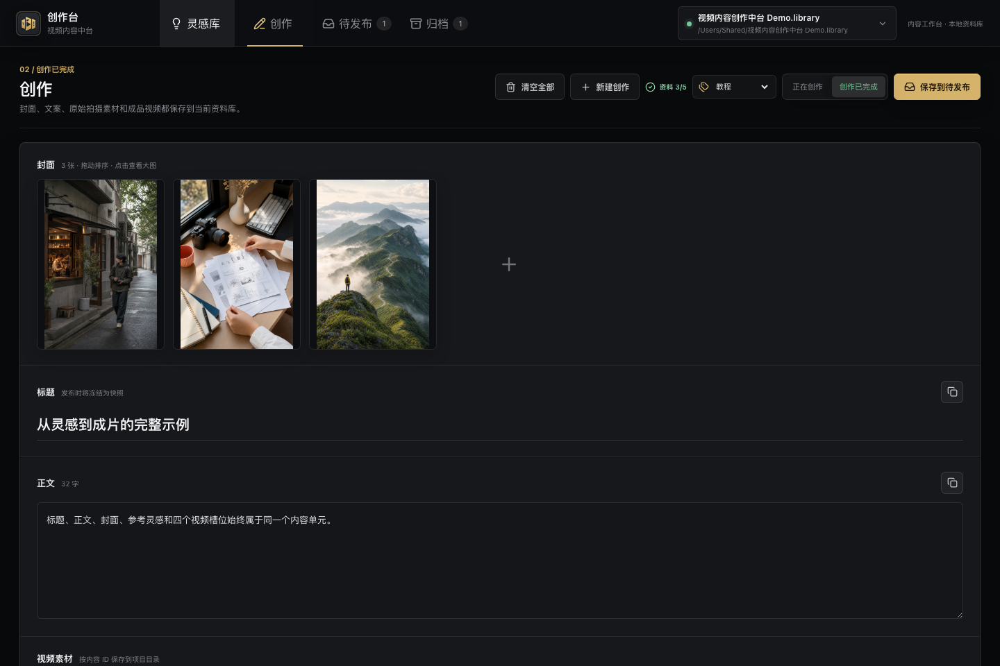
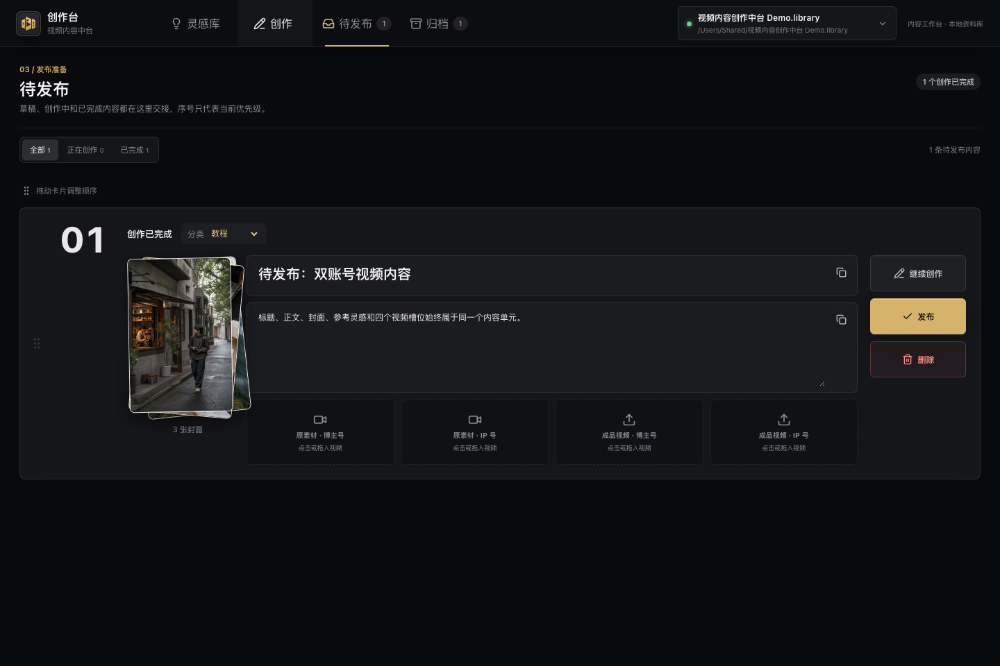

# Video Hub

一个面向真实内容生产流程的本地优先 macOS 桌面应用。它把抖音、小红书、B 站、视频号、YouTube 和 Instagram 灵感采集、内容创作、双账号素材管理、创作台整理和完成归档放进同一个 `.library` 资料库。

当前用户版本：**V1.9**（内部构建版本 `1.9.0`）

[](https://github.com/maxmaximage-hash/video-content-creation-studio/actions/workflows/ci.yml)

> 当前公开版本面向 macOS。Apple Silicon 是主要验证平台；Intel Mac 可以从源码构建，但发布前应单独完成真实应用验收。Windows 和 Linux 尚未支持。


## 这套软件解决什么问题

完整工作流是：

```text
真实平台链接
  -> 灵感库卡片
  -> 新建创作 / 加入已有创作
  -> 标题、正文、封面和参考灵感
  -> 原素材与成品视频（博主号 / IP 号）
  -> 创作台整理与排序
  -> 完成并进入归档库
```

所有页面围绕同一个不可变内容 ID 工作。封面、正文、原素材、成品和参考关系不会因为页面切换而复制成多份独立数据。

## 主要功能

### 灵感库

- 粘贴六个已支持平台的真实链接，生成同一种灵感卡片。
- 单条、多行批量链接与博主主页全量扫描共用同一套去重和入库逻辑。
- 主页任务保存候选列表和当前进度，登录失效、通道冷却或应用重启后可从中断处续跑。
- 每个平台使用独立的可见 Chromium 登录窗口保存会话。
- 保存标题、正文、作者/账号、发布时间、已暴露互动数据、封面、图文图片、视频和逐字稿。
- 逐字稿按“平台字幕 → 腾讯云当月免费额度 → 本地 Whisper”执行，卡片内可展开和复制。
- 媒体原文件统一存放在 Eagle；`.library` 只保存 Eagle item/folder 关联和展示元数据，不保存媒体副本。
- 搜索、平台筛选、用户分类和“已关联”筛选可以组合使用。
- 从灵感直接新建创作，或加入已有创作。
- 删除灵感时同步删除当前 Library 中对应内容单元，并清理创作引用。

### 创作工作台

- 标题和正文可直接编辑、复制并自动保存。
- 多封面上传、拖入、排序、放大预览和删除。
- 灵感只作为参考关系，不会复制成新的创作素材。
- 四个独立视频槽位：
  - 原素材 · 博主号
  - 原素材 · IP 号
  - 成品视频 · 博主号
  - 成品视频 · IP 号
- 视频支持点击上传和从 Finder 拖入，导入成功后保存 Eagle item 关联。
- 删除视频只解除 Library 中该槽位的索引，不删除 Eagle 原文件。



### 创作台

- 博主号与 IP 号分别维护标题、正文、封面、原素材和成品，修改会自动保存到同一创作记录。
- 正文“格式规整”提供变更预览、确认、撤销和重复执行保护，只清理 Markdown 引用、成对粗体标记、行尾空白与多余空行，不改写正文内容。
- 卡片拖动排序并持久化。
- 封面支持折叠、展开、外部拖入和多图布局。
- 四个视频槽位与创作页使用同一份数据。
- 本地媒体支持右键“在访达中显示”和原生拖出。
- 点击“完成”后内容从创作台移除，并立即进入归档库；NAS 匹配不是完成操作的前置条件。



### 归档库

- 保存完成时的双账号标题、正文、封面、成品视频、Eagle 关联、引用关系和工作流状态。
- 多条成品视频按角色、账号归属和顺序展示。
- 本地成品支持在 Finder 中定位。
- NAS 离线只显示离线状态，不把不可访问误判为文件不存在。


## 用 Codex 安装

把下面这段话直接交给 Codex：

```text
请安装这个 macOS 项目：
https://github.com/maxmaximage-hash/video-content-creation-studio

先完整阅读仓库根目录 INSTALL_WITH_CODEX.md，并严格按其中的安全门禁、构建、测试、安装和真实应用验收步骤执行。不要删除或迁移我已有的 .library，不要复制任何浏览器 Cookie，不要把测试指向真实资料库。完成后告诉我应用安装路径、Bundle ID、签名校验结果、Library 状态和仍需我手动完成的平台登录步骤。
```

Codex 专用完整任务书见 [INSTALL_WITH_CODEX.md](INSTALL_WITH_CODEX.md)。

## 手动安装

要求：

- macOS
- Git
- Node.js 22 LTS
- 至少 3 GB 可用空间（依赖、Chromium 和应用构建产物）

```bash
git clone https://github.com/maxmaximage-hash/video-content-creation-studio.git
cd video-content-creation-studio/prototype
npm ci
npm run desktop:install
```

安装脚本会：

1. 安装采集所需 Chromium。
2. 构建 React/Vite 前端。
3. 按当前 Mac 架构封装 Electron 应用。
4. 使用本机 ad-hoc 签名并严格校验。
5. 只在 Bundle ID 匹配时更新 `/Applications/Video Hub.app`，并安全移除同一应用的旧中文名称副本。
6. 安装成功后删除临时旧应用，不留下可误启动的第二份。
7. 保留所有现有 `.library` 和平台登录 profile。

更完整的手动步骤、升级和卸载方式见 [docs/installation.md](docs/installation.md)。

## 第一次启动

1. 在欢迎页点击“新建资料库”或“打开资料库”。
2. 建议把 Library 放在本机 `Documents`，或一个稳定挂载且具有读写权限的 NAS 目录。
3. 打开灵感库，只为自己要使用的平台打开对应专用登录窗口。
4. 在弹出的专用浏览器中完成平台登录或人工验证。
5. 返回应用，粘贴真实链接开始采集。

应用不会读取 Safari、Chrome 或其他浏览器的现有 Cookie，也不会把登录凭证写入 `.library`。

## API Key 与配置

平台采集本身不需要 API Key。如果希望在本地转写前优先使用腾讯云当月免费的录音文件识别，可在灵感库内配置 Tencent Cloud `SecretId` 和 `SecretKey`。密钥只存在 macOS 钥匙串，不写入 `.library` 或仓库。

平台 Cookie 只保存在本机：

```text
~/Library/Application Support/视频内容创作中台/auth-browser/
```

开发者可以用环境变量覆盖隔离资料库和登录 profile 路径，但普通桌面用户不需要配置环境变量。完整说明见 [docs/configuration.md](docs/configuration.md)。

## Library 数据结构

```text
我的内容库.library/
  library.json
  content-units/
    I000001/
      manifest.json
      copy/title.txt
      copy/body.txt
      copy/transcript.txt
      covers/
      media/images/
      media/captured-video/
    C000001/
      manifest.json
      copy/
      covers/
      media/source-video/
      media/finished-video/
      exports/
  assets/                 # 旧版兼容目录
  metadata/
  trash/
```

- `I...`：灵感内容。
- `C...`：自主创作内容。
- `relativePath`：仅用于历史本地媒体兼容记录；新媒体使用 Eagle item ID。
- `role`：`content_image`、`captured_video`、`source_video`、`finished_video` 等角色。
- `accountRole`：创作视频的 `blogger` 或 `ip` 归属。
- `canonicalSourceKey`：同一平台作品的稳定去重键。

详细架构见 [docs/architecture.md](docs/architecture.md)。

## 数据与隐私

- 仓库不包含任何真实 `.library`、平台 Cookie、NAS 数据、API Key 或用户媒体。
- 自动化只允许使用项目隔离资料库。
- 删除内容单元是不可撤销业务动作，操作前会明确确认；删除媒体只解除软件索引，不删除 Eagle 原文件。
- Eagle item 被移动后仍按 item ID 读取；Eagle item 不可用时显示失效状态。软件删除只解除索引，不删除 Eagle 原文件。
- 不要把 `auth-browser`、`.library`、测试产物或安装备份提交到 Git。

## 多电脑与 NAS

当前版本允许把 Library 放在 NAS，但只支持一个写入端。两台电脑可以只读查看同一 Library，不应同时编辑，因为当前版本没有跨机器事务和文件锁。

Eagle 使用项目固定连接：另一台电脑需要启动 Eagle，并挂载同一团队 Eagle 资料库到项目约定路径；素材文件夹 ID 和本机 API 端口由代码统一维护，不需要在 Video Hub 中重新配置。

团队多 PC 同时编辑和手机采集需要部署唯一协作服务；这不是当前公开桌面版本的一部分。直接让两台桌面应用同时写同一个 NAS Library 可能发生最后写入覆盖。

## 平台稳定性边界

六个平台各自拥有独立的适配器、登录 profile、采集队列和恢复状态。采集器会在公开页面、登录会话和备用数据通道之间自动选择，并对临时网络、限流和会话异常做分类处理。但平台可能要求登录、验证码或人工安全验证，也可能限制私密、删除、地区或年龄受限内容。

因此不能承诺任何第三方平台链接永久 100% 可采集。发布验收必须使用用户提供的真实链接在安装后的真实应用中完成；单元测试和模拟网络只能作为防回退证据。

## 本地开发

```bash
cd prototype
npm ci
npx playwright install chromium
npm run dev
```

默认开发服务只监听 `127.0.0.1`，不要将本地 API 暴露到公网。

常用命令：

```bash
npm run test:unit          # 服务层与纯逻辑测试
npm run test:ui            # 隔离 Library 的 Playwright 回归
npm run build              # Vite 生产构建
npm run desktop:pack       # 当前架构桌面包
npm run desktop:install    # 构建并安装到 /Applications
npm run docs:screenshots   # 重新生成脱敏文档截图
```

## 版本与 GitHub 同步

项目按版本批次发布，用户可见版本固定为 `VX.Y` 两段格式：

- 日常改动进入 `codex/vX.Y.Z-workbench` 开发分支，并继续默认安装到本机真实应用验收。
- `main` 只保留已经完成真实应用验收的稳定版本。
- 每轮小修递增后一位，例如 `V1.0`、`V1.1`；累计 10 轮或发生重大调整时进入下一前位，例如 `V2.0`。
- Electron、npm 和 Git 标签内部仍使用三段稳定格式，例如用户版本 `V1.1` 对应内部版本 `1.1.0`。
- 一轮改动完成后统一更新内部版本号和 Changelog，再合并、推送并创建 `vX.Y.Z` 标签。
- 标签会自动构建 Apple Silicon 应用并创建 GitHub Release。
- 应用导航栏显示版本号、Git commit 和未提交状态，便于确认本机安装包对应哪份源码。

完整流程见 [版本开发与 GitHub 发布流程](docs/release-workflow.md)。

## 后续路线

手机异地链接收集、更多平台主页扫描、批量采集和云端免费额度优先的逐字稿能力已经记录在 [产品路线](docs/roadmap.md)。这些能力会继续进入同一个灵感库和同一套 Library 数据模型，不会另起一套手机专属资产结构。

## 文档

- [Codex 安装任务书](INSTALL_WITH_CODEX.md)
- [安装、升级与卸载](docs/installation.md)
- [配置、登录与 API Key](docs/configuration.md)
- [架构和数据模型](docs/architecture.md)
- [故障排查](docs/troubleshooting.md)
- [版本开发与 GitHub 发布流程](docs/release-workflow.md)
- [产品路线](docs/roadmap.md)
- [贡献指南](CONTRIBUTING.md)
- [安全策略](SECURITY.md)
- [版本记录](CHANGELOG.md)

## 许可证

[MIT License](LICENSE)
